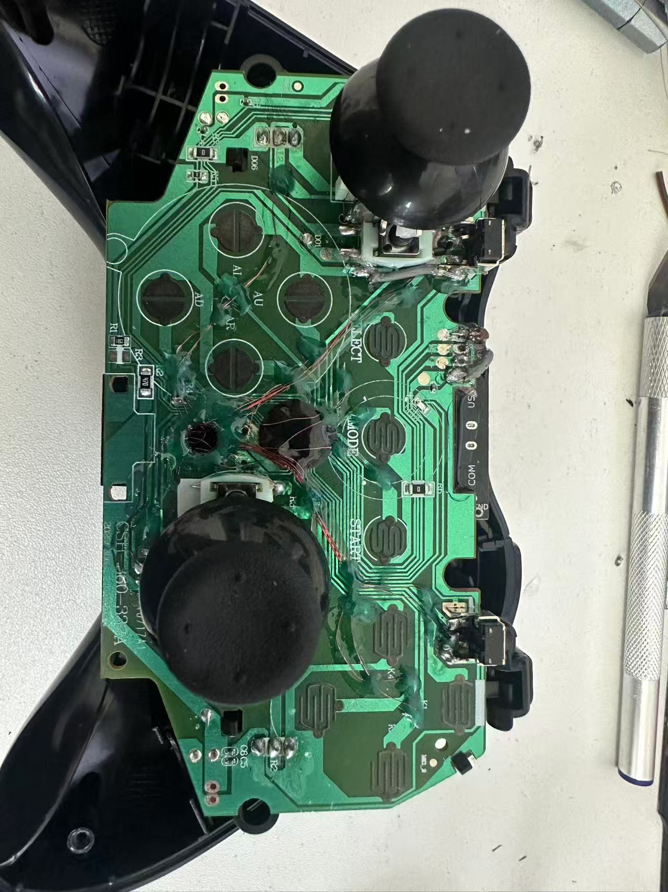
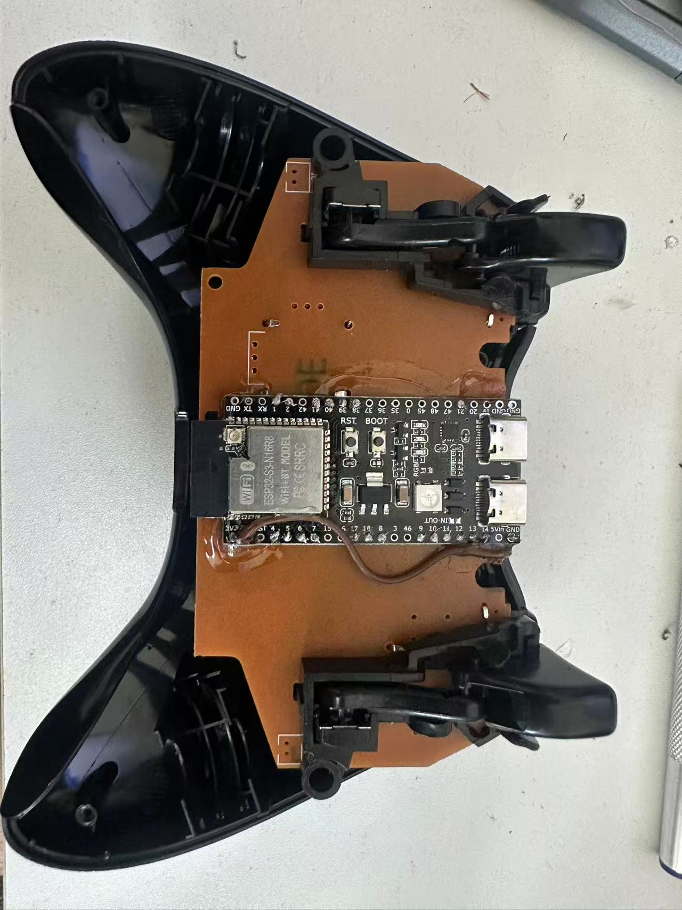
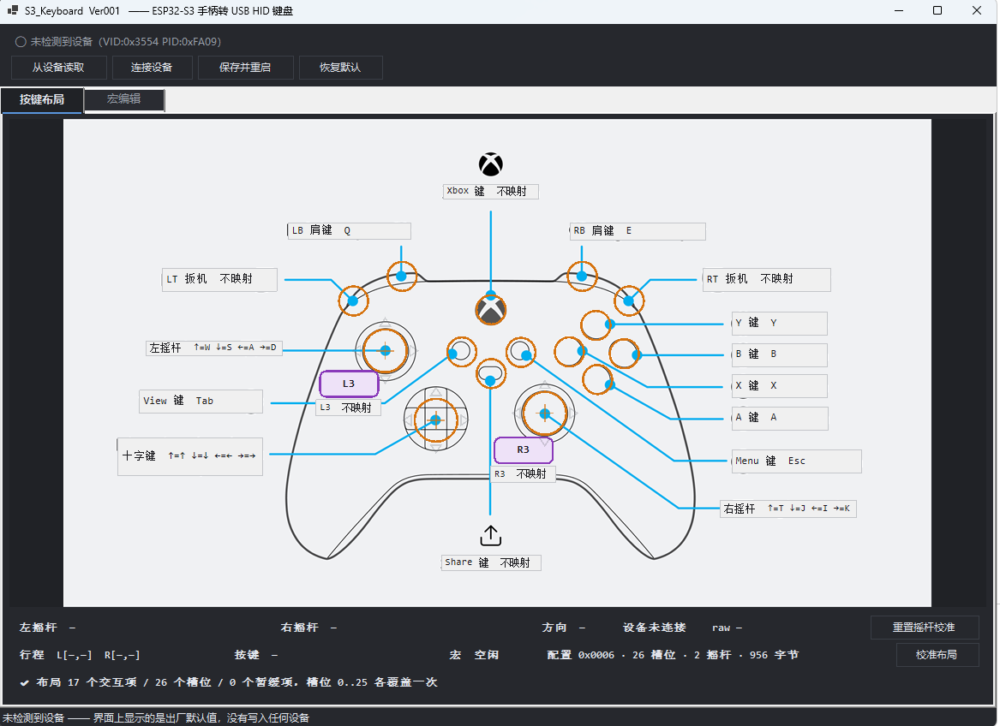
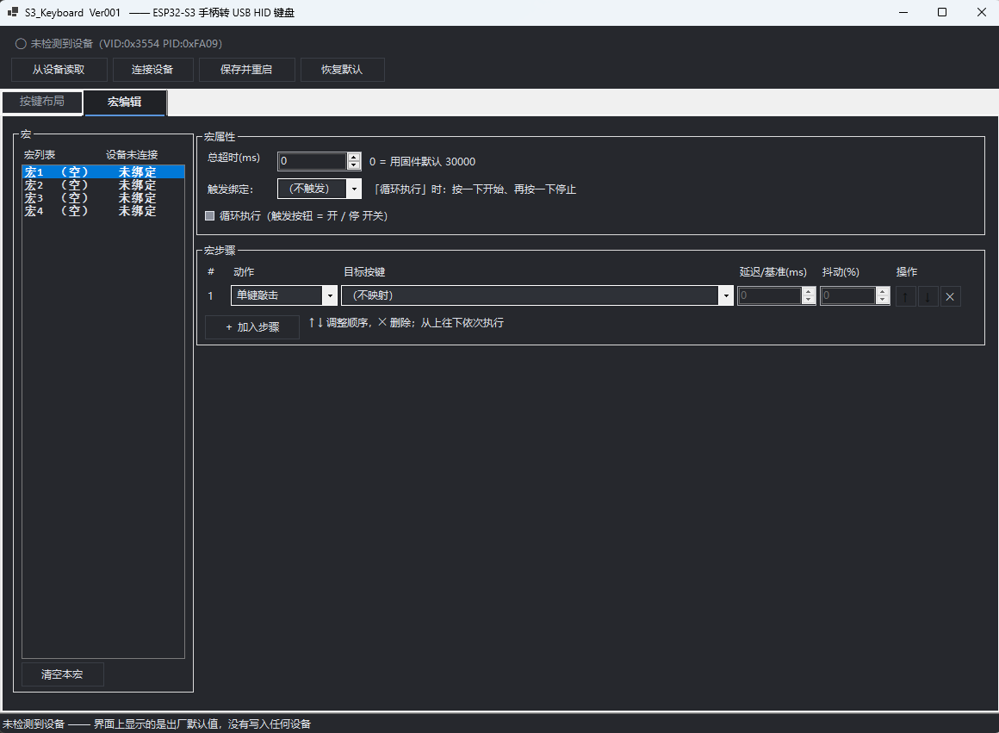

# ESP32-S3 Xbox One Keyboard Adapter

[中文 README](README_zh.md)

**An Xbox One controller to USB HID Keyboard converter** built on ESP32-S3 (N16R8) with TinyUSB and FreeRTOS.

> **Release Version: Ver001** — Final production release with full firmware, host configurator, and hardware reference documentation.

---

## Overview

This project converts an **Xbox One controller** into a **USB HID keyboard** by replacing the controller's mainboard with an ESP32-S3 module. The firmware scans 26 button inputs (including dual analog sticks via ADC) and maps them to keyboard keycodes, with full configuration via a Windows host application.

### Hardware Photos and Diagrams

<p align="center">
  
  
</p>

#### Wiring and Configuration Diagrams

<p align="center">
  
  
</p>

### Key Features

- **26 input slots**: A/B/X/Y, LB/RB, View/Menu/Xbox/Share, L3/R3, D-pad (4), Left Stick (4), Right Stick (4), LT/RT
- **Dual analog sticks** via 4-channel ADC1 (1ms scan, median filtering, deadzone/hysteresis)
- **Dual HID interfaces**: Boot Keyboard (MI_00) + Vendor Config (MI_01)
- **Macro engine**: 4 macros × 20 steps, non-blocking state machine (5ms tick)
- **NVS persistent config**: Dual-slot + CRC, rate-limited writes (1/min)
- **Real-time input reporting** (20Hz) for live UI visualization
- **Self-contained Windows configurator**: Single-file EXE (~100MB), zero-install

---

## Repository Structure

```
ESP32_S3_XBOXone_Keyboard/
├── release/Ver001/              ★ Production release package (firmware + EXE)
├── firmware/
│   └── main_fw/                 Main firmware project (ESP-IDF)
├── host/
│   ├── KbConfigurator/          C# WinForms configurator (.NET 10)
│   └── native/                  hidapi native libraries
├── tools/                       Build / flash / verification / release scripts
├── hardware_ref/
│   └── xbox_pcb/                PCB photos, pin maps, solder pad annotations
├── .gitignore
├── eim_config.toml              ESP-IDF toolchain path config
├── ESP32-S3.text                Hardware reference notes
├── 启动上位机.cmd               Quick launcher for host app
└── README.md                    This file
```

> **Note**: Build artifacts (`build/`, `managed_components/`, `bin/`, `obj/`) are excluded via `.gitignore`. The `managed_components/` folder is checked in for offline builds.

---

## Firmware (`firmware/main_fw/`)

### Build System
- **ESP-IDF v5.x** (tested with v5.3+)
- `PROJECT_VER = "Ver001"` fixed in `CMakeLists.txt`
- Custom partition table: NVS 64KB (dual-slot config), factory app

### Key Source Files (`main/`)

| File | Responsibility |
|------|----------------|
| `app_config.h` | **Single source of truth** — all constants, pin assignments, slot enums, report offsets, version macros |
| `main.c` | Entry, startup sequence, HID TX task (5ms), Input Report task (20Hz), status logging |
| `input_scan.c/h` | 18 digital inputs + 4 ADC channels (dual sticks), 1ms period, debouncing, auto-calibration |
| `keymap.c/h` | Slot press → key press/release (ref-counted, 6-key rollover protection) |
| `hid_keyboard.c/h` | Boot Keyboard HID reports (ref-counted modifiers, overflow handling) |
| `hid_config.c/h` | Vendor Feature Report protocol (fragmented R/W, CRC16) |
| `kb_config.c/h` | Config struct (956 bytes, v0x0006), defaults, validation, CRC sealing |
| `nvs_config.c/h` | NVS dual-slot storage, delayed batch writes, epoch-based reload |
| `macro_engine.c/h` | 4 macros × 20 steps, non-blocking, tap/hold/delay/rand-delay/combo |
| `crc16.c/h` | CRC-16/CCITT-FALSE |
| `usb_descriptors.c/h` | Dual HID descriptors (Boot Keyboard + Vendor `0xFF00`) |

> ⚠️ **Change constants in `app_config.h` first** — slots, pins, report offsets, version. Then run `python tools/check_consistency.py` to verify C/C#/Python alignment.

---

## Host Configurator (`host/KbConfigurator/`)

**C# WinForms (.NET 10, x64, self-contained single-file)**

### Architecture
```
KbConfigurator/
├── Program.cs              Entry + test modes (--selftest, --layout, --xlayout, etc.)
├── MainForm.cs             Main window, toolbar, status bar
├── Hid/                    KbDevice (HID I/O), HidNative (P/Invoke)
├── Protocol/               KbConfig, InputState, SlotMap, ConfigSession, Crc16
├── Model/                  KeyCodes (HID table), XboxLayout (layout.json)
├── Ui/                     DarkTheme, Layout factory, DiagramMap, KeyCombo
├── Views/                  ButtonLayoutPanel, MacroPanel, DiagramView, SlotMapPopup
├── Assets/                 Controller diagram + layout.json + factory backup
└── *Test.cs                7 verification suites (see below)
```

### Verification Suites

| Mode | Tests | Device Required |
|------|-------|-----------------|
| `--xlayout` | 125 | No |
| `--layout` | 43 | No |
| `--uilogic` | 51 | No |
| `--uitest` | 12 | No |
| `--selftest` | 22 | **Yes** |
| `--guiroundtrip` | 12 | **Yes** |
| `--shot` | — | Optional (`live` = with device) |

Additional: `tools/macro_accept.py` (37 tests, needs device), `tools/check_consistency.py` (10 tests, no device).

### Build
```cmd
dotnet build host\KbConfigurator\KbConfigurator.csproj -c Debug
```
Publish (self-contained, single-file, native libs included):
```cmd
dotnet publish host\KbConfigurator\KbConfigurator.csproj -c Release -r win-x64 --self-contained -p:PublishSingleFile=true
```

---

## Tools (`tools/`)

| Script | Purpose |
|--------|---------|
| `flash.ps1` / `flash.cmd` | **Flash with full archival**: Git commit + `flash-NNN` tag + `flash_archive/` + `FLASH_LOG.md` |
| `make_release.py` | Build release package: `python tools\make_release.py Ver001` |
| `check_consistency.py` | **Cross-language constant check** (firmware/C#/Python: slots, version, sizes, offsets) |
| `check_critical_sections.py` | Static scan for blocking calls in critical sections |
| `check_pinmap.py` | Pin map validation (duplicates, forbidden pins, ADC channel match) |
| `check_project.py` | Project integrity: script syntax, doc refs, key files, single .md |
| `macro_accept.py` | End-to-end macro verification (37 tests) |
| `cfg_proto.py` | Config channel CLI (`info` / `read` / `set` / `reset` / `demo-macro`) |
| `read_input.py` | Read one input frame, diagnose wiring vs software |
| `bootlog.py` | Capture full boot log (`python tools\bootlog.py COM5`) |
| `slot_enable.py` | Temporarily disable/enable a slot (mitigate stuck-low pins) |
| `gen_xbox_layout.py` + helpers | Generate `layout.json` from PCB diagram tracing |

---

## Hardware Reference (`hardware_ref/xbox_pcb/`)

| File | Description |
|------|-------------|
| `pinmap.csv` | **Authoritative pin table** (validated by `check_pinmap.py`) |
| `1_主板正面.jpg` ~ `5_摇杆焊点.jpg` | Controller PCB photos |
| `annotated_pads.png` | Solder pad annotations |
| `stick_pads_map.png` / `stick_pads_numbered.png` | Stick pad numbering |
| `btnboard_contacts_map.png` | Button board contact map |
| `pads/` | Per-pad cropped images |

---

## Protocol Contract (Firmware ↔ Host)

> The **sole interface contract** between firmware and host. Defined in `项目结构.md` §6 (also mirrored in `app_config.h`, `kb_config.h`, `KbConfig.cs`, `InputState.cs`).

### Config Format `0x0006` / **956 bytes**

| Offset | Length | Content |
|--------|--------|---------|
| 0 | 8 | Header: magic `0x4B42`, version, size, CRC16 |
| 8 | 16 | `stick[2]` × 8: deadzone / invert X / invert Y / reserved 5 |
| 24 | 208 | `buttons[26]` × 8: keycode, modifiers, trigger(deprecated), flags, macro_id, reserved 3 |
| 232 | 4 | `macro_count` + reserved 3 |
| 236 | 272 | `macros[4]` × 68: 4-byte header + 20 steps × 8 |
| 508 | 64 | Reserved |

- CRC16/CCITT-FALSE from offset 8 to end
- `flags`: bit0 = enabled, bit1 = triggers macro; `macro_id` = 0xFF = no macro

### Slot Mapping (26 slots)

| Slot | Function | Slot | Function |
|------|----------|------|----------|
| 0-3 | A B X Y | 12-15 | D-pad ↑ ↓ ← → |
| 4-5 | LB RB | 16-19 | Left Stick ↑ ↓ ← → |
| 6-9 | View Menu Xbox Share | 20-23 | Right Stick ↑ ↓ ← → |
| 10-11 | L3 R3 | 24-25 | **LT RT** (appended, existing numbering unchanged) |

### Input Report (RID `0x04`) / **54 bytes**

| Offset | Length | Content |
|--------|--------|---------|
| 0 | 1 | flags: bit0 valid / bit1 USB mounted / bit2 stick rail |
| 1 | 4 | **26-slot press bitmap** |
| 5 | 3 | Direction bitmaps: D-pad / L-Stick / R-Stick |
| 8 | 1 | stat: bit1 = macro running |
| 9 | 8 | 4-axis raw (LX, LY, RX, RY, u16 each) |
| 17 | 8 | 4-axis center (boot calibration) |
| 25 | 4 | uptime_ms |
| 29 | 4 | sequence |
| 33 | 1 | Axis fault mask (bit0..3) |
| 34 | 4 | **26-slot raw GPIO levels** (pre-debounce, wiring diag) |
| 38 | 16 | 4-axis travel min/max |

### Config Channel Commands (Feature Report RID `0x03`, 63-byte payload)

Frame header (9 bytes): `CMD / SEQ / FLAGS(bit0=LAST) / OFF(u16) / TOTAL(u16) / CRC16(u16)`, followed by 54 bytes data.

| Command | Value | Command | Value |
|---------|-------|---------|-------|
| GET_INFO | 0x01 | MACRO_RUN | 0x08 |
| CFG_READ | 0x02 | STATUS | 0x09 |
| CFG_WRITE | 0x03 | REBOOT | 0x0A |
| CFG_SAVE | 0x04 | ACK | 0x80 |
| CFG_RESET | 0x05 | NACK | 0x81 |
| CALIB_RESET | 0x06 | 0x07 | Deprecated (rejected) |

### USB Identity
- `VID 0x3554 / PID 0xFA09` (cloned from generic 2.4G receiver, for single-machine learning only)
- **No serial number** (`iSerialNumber = 0`) — avoids Windows Code 42 (duplicate device)
- Two HID interfaces: IF 0 = Boot Keyboard, IF 1 = Vendor Custom (`UP:0xFF00`)

---

## Build & Flash

### Prerequisites
- ESP-IDF v5.3+ (via [Espressif IDF Installer](https://dl.espressif.com/dl/eim/eim.exe))
- .NET 10 SDK
- Python 3.10+

### Firmware
```cmd
# One-time setup (adds managed_components for offline build)
idf.py -C firmware/main_fw set-target esp32s3
idf.py -C firmware/main_fw build
```
Artifacts in `firmware/main_fw/build/`: `main_fw.bin`, `bootloader/bootloader.bin`, `partition_table/partition-table.bin`.

### Host App
```cmd
dotnet build host\KbConfigurator\KbConfigurator.csproj -c Debug
```

### Flash (with full archival)
```cmd
tools\flash.cmd COM5
```
> Always verify after flash: `python tools\cfg_proto.py info COM5`

### Release Package
```cmd
python tools\make_release.py Ver002 --note "What changed"
```
Outputs to `release/Ver002/` with EXE, firmware bins, and `flash.cmd`.

---

## Design Rules (Hard Lessons Learned)

1. **Critical sections touch memory only** — no logging, queues, delays inside locks. Once caused "loop macro 2nd press = device reboot". Verify with `check_critical_sections.py`.

2. **Protocol constants must sync in 3 places** (C macros, C# constants, Python constants). No compiler help. Run `check_consistency.py` after any change.

3. **Flash only via `tools\flash.cmd`** — it tags, archives, logs. **Always verify device reports new version** after flash (scripts can lie).

4. **UI changes need screenshots** — "text clipped", "dropdown all black" pass all asserts but are visibly broken.

---

## License

This project is licensed under the **MIT License** — see [LICENSE](LICENSE) for details.

> **Note on VID/PID**: The USB VID:PID (0x3554:0xFA09) is cloned from a generic 2.4G receiver for **personal learning use only**. Do not use in commercial products. Obtain your own VID from usb.org for distribution.

---

## Acknowledgments

- [ESP-IDF](https://github.com/espressif/esp-idf) & [TinyUSB](https://github.com/hathach/tinyusb) — excellent frameworks
- [hidapi](https://github.com/libusb/hidapi) — cross-platform HID access
- Xbox controller hardware community for PCB reference data

---

**Ver001** — Final release. Built for learning, documented for reproducibility.
